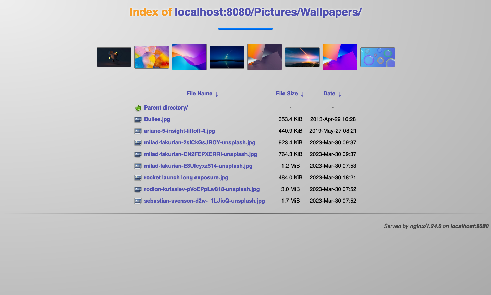
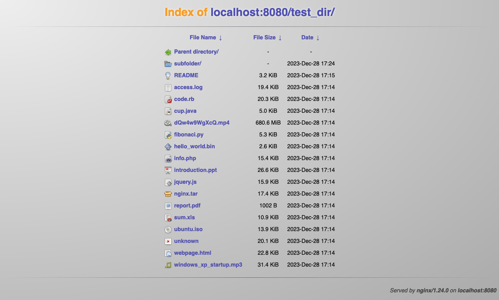

# Tango icons theme for nginx FancyIndex

A small and simple project adding some style to your nginx directory listings, with Tango icons and an image gallery.

<div style="text-align:center">
  <a href="./screenshot_1.png"></a>
  <a href="./screenshot_2.png"></a>
</div>

This was initially used on my hobby server, I'm publishing it in the hope that it will be useful to someone but you're probably better off with [h5ai](https://github.com/lrsjng/h5ai) - it has more features and is widely adopted.

## Usage
Once set up, simply browse to a directory and use the file list to move around. To trigger the gallery, add `#gallery` at the end of the URL (yes, in the browser address bar). It will ask if you want to explore child directories in search of other images to add to the gallery, then add a progress bar at the top of the page giving a rough estimate of the directory exploration progress. Once the progress bar is full, click on one image to show it on the full page, zoom on it...

Pro tips:
* Change the list sorting by clicking on column headers (the arrow will invert sorting)
* At the top of the page, each part of the URL is clickable and will bring you to the corresponding directory

Keep in mind: file icons are based on file extensions, not on file contents.

## Setup
You will need an nginx server with the following non-standard modules:
* [Image filter module](https://nginx.org/en/docs/http/ngx_http_image_filter_module.html)
* [FancyIndex](https://github.com/aperezdc/ngx-fancyindex)

This can be obtained by compiling nginx with the fancyindex module sources around, and the following configuration options:
```bash
./configure --with-http_addition_module --with-http_image_filter_module --add-module=/path/to/ngx-fancyindex
```

Put the [icons](./icons) folder of this repository in `/srv/http` (`/srv/http/icons/unknown.png` should exist) and [fancyindex.conf](./fancyindex.conf) in the nginx configuration directory (there should be a file named `nginx.conf` in it - this is usually `/etc/nginx` or `/etc/nginx/conf`).

Make sure you have installed php-fpm on your server as well and that it is active. In `fancyindex.conf`, replace `/run/php-fpm/php-fpm.sock` with the php-fpm socket path.

Update the nginx configuration: in your `server {` block, add two lines
```bash
set $root "//path/to/your/server/documents"; # Replace this with the directory served by nginx - make sure to have two slashes at the start
include fancyindex.conf;
```

Restart nginx.

That's it! Browse to a directory of your server without an index file and it should show a file listing instead of a 403 error page. If something does not work as expected, check nginx and php-fpm error logs. The browser console can also give some hints.

To enable/disable by directory, simply tweak the `fancyindex` directive in the corresponding `location {` blocks (set to `on` to enable directory listing and `off` to disable it).

### Dockerfile
A quick and dirty Dockerfile is available [here](./Dockerfile), use like this:
```bash
docker build . -t ngx-fancyindex-tango
docker run -d --rm --name ngx-fancyindex-tango -v $(pwd):/usr/local/nginx/html -p 8080:80 ngx-fancyindex-tango
# Open https://localhost:8080 to browse your directory

# To stop it, run
docker stop -t0 ngx-fancyindex-tango
```

## Credits
This was initially a port of [this icon theme for Apache](https://fortintam.com/blog/icones-tango-pour-apache/). I've then made some design adjustments using [Blueprint](https://blueprintjs.com/)'s color palette and added an image gallery using [Photoswipe](https://photoswipe.com/).

Licensed under the MIT license - icons come from [the Tango Project](https://www.tango-project.org/) and are in the public domain.
